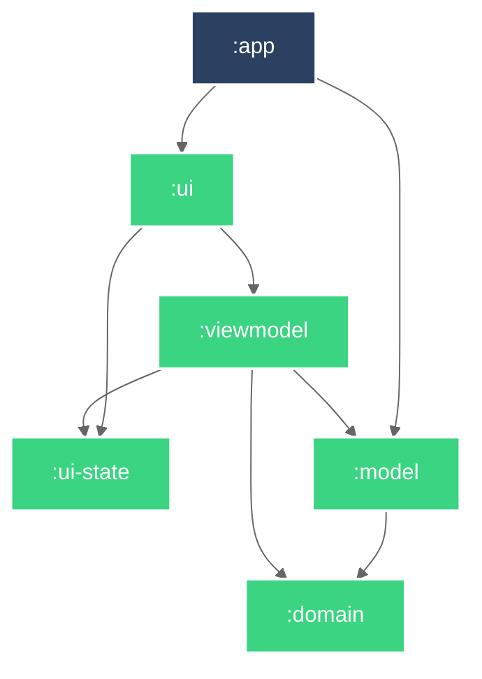

# Android 애플리케이션 템플릿

Android 애플리케이션 개발을 위한 템플릿 레포지토리.

## 개발 환경 설정

[GitHub Packages](https://github.com/JustBurrow?tab=packages) 읽기 권한 설정

1. [New personal access token (classic)](https://github.com/settings/tokens/new)에서 토큰을 생성.
   
    - `Note` : `READ_PACKAGES_TOKEN`
    - `read:packages` 권한을 선택.
2. [`sample-configuration.json`](sample-configuration.json)를 복사해서 `configuration.json` 파일을 생성.
3. `configuration.json` 파일의 `READ_PACKAGES`를 실재 토큰으로 교체.
4. GitHub 레포지토리의 `Repository secrets`에 `READ_PACKAGES_TOKEN`을 추가.
   
5. GitHub 레포지 설정에서 `main` 브랜치 보호 규칙 추가.
   

## Module Graph

## 문서

- [Architecture Decision Records](doc/adr/README.md)

## 참고

- [JustBurrow/packages](https://github.com/JustBurrow/packages/packages)
- [New personal access token (classic)](https://github.com/settings/tokens/new)
- [iurysza/module-graph](https://github.com/iurysza/module-graph)
- [.ignore](https://plugins.jetbrains.com/plugin/7495--ignore)